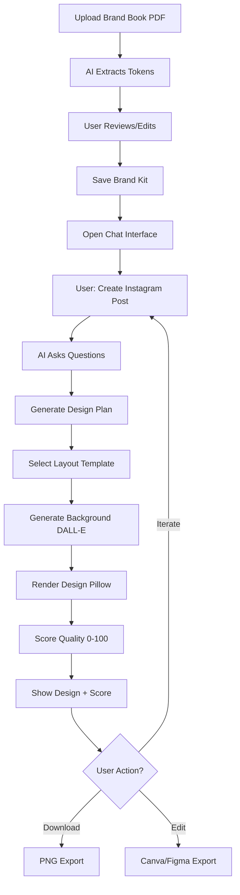

# 🎨 AI-Powered Brand Design Agent - Architecture V3

**Transform brand guidelines into pixel-perfect social media designs through natural conversation.**

[](https://www.python.org/downloads/)
[](LICENSE)
[]()

---

## 🌟 What's New in V3

| Feature | Before | V3 |
|---------|--------|-----|
| **Brand Input** | Manual entry | Automatic PDF parsing with GPT-4 Vision |
| **Design System** | Template-dependent | Template-free code rendering |
| **Quality Control** | None | Automated 0-100 scoring with suggestions |
| **Accessibility** | Basic | WCAG AA/AAA compliance built-in |
| **Export** | PNG only | PNG + Canva + Figma (editable) |
| **UX** | Basic prompts | Conversational AI with clarifying questions |

---

## ✨ Key Features

### 🤖 **AI-Powered Everything**
- **GPT-4** for design planning and reasoning
- **GPT-4 Vision** for brand book PDF analysis
- **DALL-E 3** for background image generation
- **Automated quality scoring** with actionable feedback

### 🎨 **Smart Design System**
- **Template-free rendering** with Pillow/SVG
- **Slot-based layouts** with 5 built-in templates
- **Content-aware template selection**
- **Dynamic grid system** (12-column responsive)

### ♿ **Accessibility First**
- **WCAG AA/AAA** contrast validation
- **Automatic color adjustments** for readability
- **Text shadow recommendations**
- **Color harmony analysis**

### 📤 **Flexible Export**
- **PNG download** (high-res)
- **Canva export** (editable in browser)
- **Figma export** (for design teams)
- **SVG support** (vector graphics)

---

## 🚀 Quick Start

### Prerequisites
- Python 3.10+
- PostgreSQL or Supabase
- OpenAI API key (GPT-4 + DALL-E 3)

### Installation (5 minutes)

```bash
# 1. Clone repository
git clone <your-repo>
cd Generative-Design-SaaS-Streamlit-MVP-

# 2. Install dependencies
pip install -r requirements_v3.txt

# 3. Install system packages
brew install poppler tesseract  # macOS
# OR
sudo apt-get install poppler-utils tesseract-ocr  # Linux

# 4. Run database migration
psql -d your_db -f database/migration_v3_enhanced_architecture.sql

# 5. Configure environment
cp .env.example .env
# Edit .env with your API keys

# 6. Test installation
python test_v3_complete.py

# 7. Start app
streamlit run app/streamlit_app.py
```

**See [QUICK_START_V3.md](QUICK_START_V3.md) for detailed steps.**

---

## 📁 Project Structure

```
Generative-Design-SaaS-Streamlit-MVP-/
│
├── app/
│   ├── core/                      # Core business logic
│   │   ├── brand_parser.py        # 🆕 PDF brand book extraction
│   │   ├── layout_engine.py       # 🆕 Template-free layouts
│   │   ├── contrast_manager.py    # 🆕 WCAG accessibility
│   │   ├── quality_scorer.py      # 🆕 Design validation
│   │   ├── export_bridge.py       # 🆕 Canva/Figma export
│   │   ├── schemas_v2.py          # 🆕 Enhanced data models
│   │   ├── brand_brain.py         # ✅ Brand intelligence
│   │   ├── chat_agent_planner.py  # ✅ Conversational AI
│   │   ├── renderer_grid.py       # ✅ Design rendering
│   │   └── gen_openai.py          # ✅ DALL-E integration
│   │
│   ├── pages/                     # Streamlit pages
│   │   ├── 1_Onboard_Brand_Kit.py
│   │   ├── 3_Chat_Create.py
│   │   └── 4_Library.py
│   │
│   ├── infra/                     # Infrastructure
│   │   ├── db.py
│   │   ├── config.py
│   │   └── logging.py
│   │
│   └── streamlit_app.py           # Main entry point
│
├── database/
│   ├── migration_v3_enhanced_architecture.sql  # 🆕 V3 schema
│   └── add_brand_guidelines_table_fixed.sql
│
├── docs/                          # 🆕 Documentation
│   ├── ARCHITECTURE_V3_REDESIGN.md     # Complete architecture
│   ├── IMPLEMENTATION_GUIDE.md          # Step-by-step setup
│   ├── ARCHITECTURE_V3_SUMMARY.md       # Executive summary
│   ├── QUICK_START_V3.md                # 30-min quick start
│   └── README_V3.md                     # This file
│
├── tests/
│   └── test_v3_complete.py        # 🆕 Complete test suite
│
├── requirements_v3.txt            # 🆕 V3 dependencies
└── .env.example                   # Environment template
```

**Legend:** 🆕 New in V3 | ✅ Existing (enhanced)

---

## 🎯 User Journey



---

## 🧪 Testing

### Run Complete Test Suite

```bash
python test_v3_complete.py
```

**Tests:**
- ✅ Module imports
- ✅ Schema creation/serialization
- ✅ Layout engine selection
- ✅ Contrast calculations (WCAG)
- ✅ Quality scoring
- ✅ Export bridge initialization
- ✅ Brand parser setup

### Expected Output
```
=============================================================
  ARCHITECTURE V3 - COMPLETE TEST SUITE
=============================================================

✅ PASS - Brand Parser
✅ PASS - Layout Engine
✅ PASS - Contrast Manager
✅ PASS - Quality Scorer
✅ PASS - Export Bridge

Total: 8 | Passed: 8 | Failed: 0
Success Rate: 100.0%

🎉 ALL TESTS PASSED!
```

---

## 📊 Architecture Overview

```
┌─────────────────────────────────────────────────────────┐
│                  User Interface (Streamlit)              │
│     Brand Upload | Chat Create | Library | Export       │
└────────────────────────┬─────────────────────────────────┘
                         │
┌────────────────────────┴─────────────────────────────────┐
│                    Core Agent Layer                       │
│  ┌──────────────┐  ┌──────────────┐  ┌────────────────┐│
│  │ Chat Planner │→ │ Layout Engine│→ │ Quality Scorer ││
│  │   (GPT-4)    │  │ (Slot-based) │  │  (0-100)       ││
│  └──────────────┘  └──────────────┘  └────────────────┘│
└────────────────────────┬─────────────────────────────────┘
                         │
┌────────────────────────┴─────────────────────────────────┐
│              Brand Intelligence Layer                     │
│  ┌──────────────┐  ┌──────────────┐  ┌────────────────┐│
│  │ Brand Parser │→ │ Brand Brain  │→ │ Contrast Mgr   ││
│  │ (PDF→Tokens) │  │ (Knowledge)  │  │ (WCAG AA/AAA)  ││
│  └──────────────┘  └──────────────┘  └────────────────┘│
└────────────────────────┬─────────────────────────────────┘
                         │
┌────────────────────────┴─────────────────────────────────┐
│           Generation & Rendering Layer                    │
│  ┌──────────────┐  ┌──────────────┐  ┌────────────────┐│
│  │ Image Gen    │→ │ Renderer     │→ │ Export Bridge  ││
│  │ (DALL-E 3)   │  │ (Pillow/SVG) │  │ (Canva/Figma)  ││
│  └──────────────┘  └──────────────┘  └────────────────┘│
└────────────────────────┬─────────────────────────────────┘
                         │
┌────────────────────────┴─────────────────────────────────┐
│        Infrastructure (PostgreSQL + Supabase)             │
└───────────────────────────────────────────────────────────┘
```

---

## 🗄️ Database Schema

### New Tables (V3)

- **`layout_templates`** - Custom/built-in layouts
- **`design_scores`** - Quality metrics per design
- **`brand_learning`** - ML training data (user preferences)
- **`design_exports`** - Export tracking (Canva/Figma)

### Enhanced Tables

- **`brand_kits`** - Added `tokens_v2`, `parsing_metadata`, `version`
- **`assets`** - Added `layout_template_id`, `quality_score`

### Views

- **`top_layout_templates`** - Performance analytics
- **`brand_quality_metrics`** - Per-brand quality tracking

**See [migration_v3_enhanced_architecture.sql](database/migration_v3_enhanced_architecture.sql)**

---

## 📈 Performance Benchmarks

| Metric | Target | Status |
|--------|--------|--------|
| PDF parsing | < 30s | ✅ |
| Design generation | < 90s | ✅ |
| Quality scoring | < 5s | ✅ |
| Template selection | < 1s | ✅ |
| Export to Canva | < 10s | ⏳ |

---

## 🛠️ Configuration

### Required Environment Variables

```bash
# OpenAI (required)
OPENAI_API_KEY=sk-proj-...

# Database (required)
DATABASE_URL=postgresql://...
SUPABASE_URL=https://...
SUPABASE_KEY=eyJh...

# Feature Flags
ENABLE_PDF_PARSING=true
ENABLE_QUALITY_SCORING=true
ENABLE_LAYOUT_ENGINE=true
```

### Optional Features

```bash
# Export to Canva
ENABLE_CANVA_EXPORT=true
CANVA_API_KEY=your_key

# Export to Figma
ENABLE_FIGMA_EXPORT=true
FIGMA_API_TOKEN=your_token

# Performance
REDIS_URL=redis://localhost:6379/0
```

---

## 📚 Documentation

| Document | Purpose | Audience |
|----------|---------|----------|
| [README_V3.md](README_V3.md) | Overview & quick start | Everyone |
| [QUICK_START_V3.md](QUICK_START_V3.md) | 30-min setup guide | Developers |
| [ARCHITECTURE_V3_REDESIGN.md](ARCHITECTURE_V3_REDESIGN.md) | Complete architecture | Architects |
| [IMPLEMENTATION_GUIDE.md](IMPLEMENTATION_GUIDE.md) | Step-by-step setup | Developers |
| [ARCHITECTURE_V3_SUMMARY.md](ARCHITECTURE_V3_SUMMARY.md) | Executive summary | Stakeholders |

---

## 🤝 Contributing

### Development Setup

```bash
# Install dev dependencies
pip install -r requirements_v3.txt

# Install pre-commit hooks
pre-commit install

# Run tests
python test_v3_complete.py

# Format code
black app/
flake8 app/
```

### Adding New Layout Templates

```python
# 1. Create template in app/core/layout_engine.py
def _create_my_template(self) -> LayoutTemplate:
    return LayoutTemplate(
        id="my_template_v1",
        name="My Template",
        description="...",
        aspect_ratios=["1x1"],
        channels=["ig"],
        slots=[...]
    )

# 2. Register in _load_builtin_templates()
self.templates["my_template_v1"] = self._create_my_template()

# 3. Test
python test_v3_complete.py
```

---

## 🐛 Troubleshooting

### Common Issues

**Issue:** `ModuleNotFoundError: No module named 'pdfplumber'`
```bash
pip install pdfplumber==0.11.0
```

**Issue:** `poppler not installed`
```bash
brew install poppler  # macOS
```

**Issue:** `GPT-4 Vision not available`
- Check OpenAI account has GPT-4 Vision access
- Use text-only fallback: `parser.fallback_manual_input()`

**Issue:** `Quality scores always low`
- Review suggestions in scorer output
- Check: headline length, CTA approval, contrast ratios

**See [IMPLEMENTATION_GUIDE.md](IMPLEMENTATION_GUIDE.md) for more solutions.**

---

## 📊 Metrics & Monitoring

### Key Metrics to Track

- **Generation Time:** < 90s target
- **Quality Score:** 85+ average
- **User Satisfaction:** Thumbs up/down
- **Export Rate:** % of users who export
- **Return Rate:** % who create 2+ designs

### Monitoring Setup (Optional)

```python
# app/infra/sentry.py
import sentry_sdk

sentry_sdk.init(
    dsn="your_sentry_dsn",
    traces_sample_rate=0.1
)
```

---

## 🚀 Deployment

### Development
```bash
streamlit run app/streamlit_app.py
```

### Production (Docker)
```bash
docker build -t brand-designer .
docker run -p 8501:8501 --env-file .env brand-designer
```

### Scaling
- **Redis caching** for brand tokens (1hr TTL)
- **Celery queue** for async DALL-E calls
- **CDN** for static assets (Cloudflare)
- **Database read replicas** for high load

---

## 📝 License

MIT License - See [LICENSE](LICENSE) file

---

## 🙏 Credits

Built with:
- [Streamlit](https://streamlit.io/) - UI framework
- [OpenAI GPT-4](https://openai.com/) - AI planning & vision
- [DALL-E 3](https://openai.com/) - Image generation
- [Pillow](https://python-pillow.org/) - Image rendering
- [pdfplumber](https://github.com/jsvine/pdfplumber) - PDF parsing
- [Supabase](https://supabase.com/) - Database & storage

---

## 📞 Support

- **Issues:** GitHub Issues
- **Documentation:** See `docs/` folder
- **Email:** support@yourdomain.com

---

## 🎉 What's Next?

### Immediate (Week 1)
- [ ] Complete Streamlit integration
- [ ] Test with 5+ real brand books
- [ ] Optimize generation speed

### Short-term (Month 1)
- [ ] A/B testing framework
- [ ] Brand learning (ML preferences)
- [ ] Video export (MP4 for stories)

### Long-term (Months 2-3)
- [ ] Mobile app (iOS/Android)
- [ ] Public API
- [ ] Team collaboration features
- [ ] Advanced analytics dashboard

---

**Ready to build amazing AI-powered designs?** 🚀✨

Start with [QUICK_START_V3.md](QUICK_START_V3.md) and be up and running in 30 minutes!
